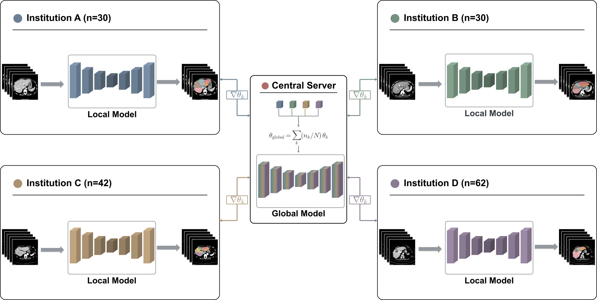

# Federated Learning for Automatic Segmentation of Nine Couinaud Liver Segments across Four Institutions: A Feasibility Study

Official implementation of the feasibility study on privacy-preserving, real-world multi-institutional
**federated learning (FedAvg)** for automatic segmentation of the nine Couinaud liver segments
(I, II, III, IVa, IVb, V–VIII) on abdominal CT.

<p align="center">
  
</p>

Each institution keeps its raw CT locally, trains a local **SegResNet** (MONAI), and transmits only
parameter updates to a central server, which aggregates a global model by sample-size-weighted
averaging (θ_global = Σ (n_k/N)·θ_k) and redistributes it.

## Results (held-out test sets)

| Institution (n_test) | Single-center Dice | Federated Dice | ΔDice |
|---|---|---|---|
| A (3) | 0.545 | 0.742 | +0.197 |
| B (3) | 0.653 | 0.768 | +0.115 |
| C (4) | 0.610 | 0.766 | +0.156 |
| D (6) | 0.668 | 0.719 | +0.052 |

The federated model outperformed single-center training at **all four institutions**, with the
largest gains at institutions whose local data alone yielded lower performance.

## Repository structure

```
src/
  fed_core/                  # Flower-based FL server / client / strategies
  use_cases/liver_segmentation/
    main_server.py           # FL server entry point
    main_client.py           # FL client entry point (run at each institution)
    models/segresnet_morph.py
    utils/{dataset,metrics,loss}.py
training/
  train_single.py            # Single-center baseline training
analysis/
  compare_single_fl.py       # Patient-level paired bootstrap (Dice), CI / p
  seg_visualize.py           # CT | GT | single | federated overlay figures
  inference_dice_auc.py      # Held-out inference metrics
  volumetry.py               # GT-based segment volumetry, lobar ratio, FLR
configs/                     # spacing / cirrhosis CSV templates (PHI not distributed)
```

## Environment

All federated training runs were performed with:

| Component | Version |
|---|---|
| Python | 3.12.4 |
| PyTorch | 2.12.0 (CUDA 12.6 build) |
| MONAI | 1.5.2 |
| Flower (flwr) | 1.11.1 |
| GPU | NVIDIA Quadro RTX 8000 (48 GB), driver 560.35 |

Statistical analysis / figure scripts were additionally tested on Python 3.9.21 with PyTorch 2.7.0.

```bash
conda create -n fedmed python=3.12 -y
conda activate fedmed
pip install -r requirements.txt
```

Alternatively, install with [uv](https://docs.astral.sh/uv/) using the committed `pyproject.toml` / `uv.lock`:

```bash
uv sync
```

## Usage

**1. Data layout** (per patient): `data/combined_80/<patient_id>/{image.npy, mask.npy}`
`image.npy` = (D, 512, 512) uint8; `mask.npy` = (18, D, 512, 512) — ch0 background,
ch1–9 Couinaud segments, ch10–17 lesions. Volumes are resampled to 256×256 in-plane and
standardized to 80 slices (zero-padded if fewer) at load time.

**2. Single-center baseline**

```bash
python training/train_single.py
```

**3. Federated learning** — start the server first (the server holds **no data**), then run a
client at each institution (any order; each client auto-scans its local data folder):

```bash
# Central server (default port 9595, see configs/base.yaml)
./src/run_liver_server.sh

# Each institution — SERVER_ADDRESS + local data dir
./src/run_liver_client.sh <SERVER_IP>:9595 /data/liver_ct
```

Or invoke the entry points directly:

```bash
python src/use_cases/liver_segmentation/main_server.py --config src/use_cases/liver_segmentation/configs/base.yaml
python src/use_cases/liver_segmentation/main_client.py --server-address <SERVER_IP>:9595 --data-dir /data/liver_ct
```

Before joining, each institution can verify dependencies, GPU, data layout, and server
connectivity with:

```bash
python src/use_cases/liver_segmentation/check_ready.py --data-dir /data/liver_ct --server-address <SERVER_IP>:9595
```

10 rounds × 10 local epochs, FedAvg aggregation; architecture, seed, and effective
training budget matched to the single-center setting.

**4. Evaluation**

```bash
python analysis/compare_single_fl.py --single-weight <single.pth> --fl-weight <global.pth> \
    --data-dir data/combined_80
python analysis/seg_visualize.py --test-only
```

## Data availability

CT images and annotations contain protected health information and are **not distributed**.
Patient-level spacing / cirrhosis metadata used by `analysis/volumetry.py` must be provided
locally as `configs/spacing.csv` and `configs/cirrhosis.csv` (see `.example` templates).

## Citation

Manuscript under preparation. Citation information will be added upon publication.
